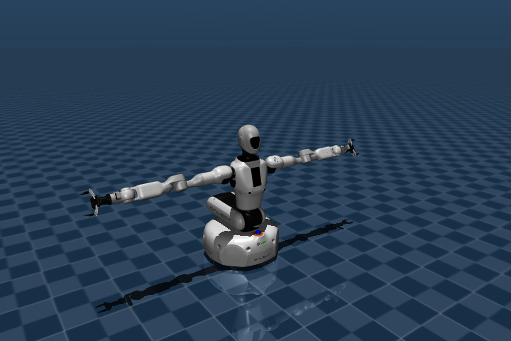

# Galbot One Golf Description


ROS 2 description package for Galbot One Golf, including URDF, MJCF, and USD assets.

## Build

```bash
colcon build --packages-select galbot_one_golf_description --symlink-install
source install/setup.bash
```

## Checkout

## Display

```bash
ros2 launch galbot_one_golf_description display.launch.py
ros2 launch galbot_one_golf_description display.launch.py gui:=false
ros2 launch galbot_one_golf_description display.launch.py urdf_path:=$(pwd)/urdf/galbot_one_golf_fixed_base.urdf
```

By default the launch file displays `urdf/galbot_one_golf.urdf`. Use
`urdf_path` to preview another preset or a URDF generated by
`scripts/create_description.py`.

## URDF

Preset URDF files:

- `urdf/galbot_one_golf.urdf`
- `urdf/galbot_one_golf_fixed_base.urdf`

`galbot_one_golf.urdf` keeps the full visual model and exposes the four main
wheel joints as continuous joints. `galbot_one_golf_fixed_base.urdf` keeps the
same visual model but fixes the wheel joints for display, planning, and
fixed-base conversion workflows. Passive omni-wheel roller joints are omitted
from preset URDFs to keep the assets compact.

Regenerate a preset URDF from xacro:

```bash
python3 scripts/create_description.py
```

The script prompts for wheel configuration and output file path. Keeping the
default output path writes `urdf/galbot_one_golf.urdf`. If you want to keep a
separate fixed-base export, enter a custom output path during the prompt.

Generate an individual component URDF directly from xacro:

```bash
xacro xacro/component.xacro type:=omni_chassis > omni_chassis.urdf
xacro xacro/component.xacro type:=omniwheel > omniwheel_10.urdf
xacro xacro/component.xacro type:=left_arm > left_arm.urdf
xacro xacro/component.xacro type:=wrist_camera arm_camera:=d405 > wrist_camera.urdf
xacro xacro/components/omniwheel_10.xacro omniwheel_standalone:=true > omniwheel_10.urdf
```

| Default URDF model |
| --- |
|  |

## MJCF

MJCF files are generated with `urdf-to-mjcf`. See
[docs/mjcf.md](docs/mjcf.md) for the exact regeneration commands and variant
notes.

MJCF base variants:

- `mjcf/galbot_one_golf.xml`: wheeled base, with `wheel1_joint` through
  `wheel4_joint` velocity actuators.
- `mjcf/galbot_one_golf_fixed_base.xml`: fixed base, with no base or wheel drive
  joints.
- `mjcf/galbot_one_golf_planar_base.xml`: virtual planar base, with
  `base_x_joint`, `base_y_joint`, and `base_yaw_joint` velocity actuators.

| MJCF visual model |
| --- |
|  |

## USD

The main USD entry point is `usd/galbot_one_golf.usda`. Related payloads,
textures, and example scene files are stored under `usd/`.

## Package Layout

- `xacro/`: source robot descriptions
- `urdf/`: preset and generated URDF files
- `mjcf/`: MuJoCo mjcf models
- `usd/`: USD models
- `meshes/`: visual and collision meshes
- `launch/`: display launch files
- `config/`: configuration files
- `scripts/`: helper scripts
- `docs/`: regeneration notes and rendered previews

## LICENSE

This software is licensed under the Apache License 2.0. See `LICENSE` for details.
